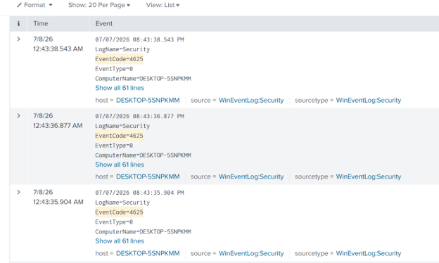
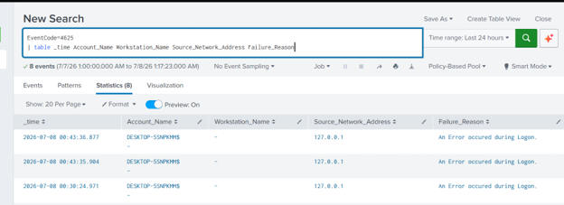

# Brute Force Simulation

## Objective

Generate repeate failed logon attempts to validate brute-force detection.

---

## Procedure

1. Lock the workstation.
2. Enter an incorrect password multiple times.
3. Trigger the configured account lockout policy.

---

## Expected Telemetry
- Windows Security Event 4625 (Failed Logon)
- Windows Security Event 4740 (Account Lockout *if configured)

## Related Detection
detections/brute-force.md
