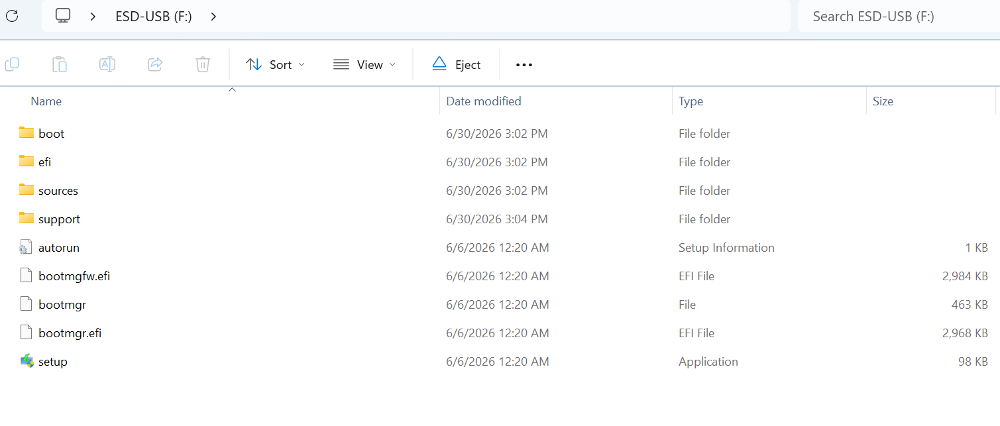
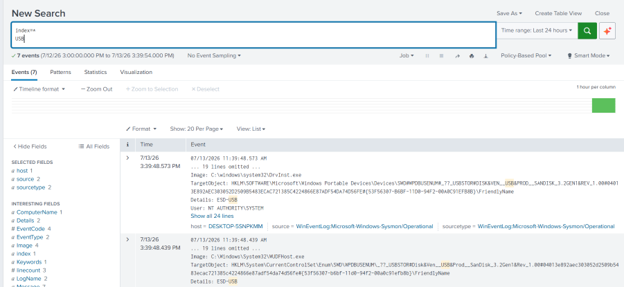

# USB Entry

A dashboard was configured to visualize USB insertions into a device.

This is first done by inserting a removable storage drive into the device:

Then checking the dashboard for detections.

