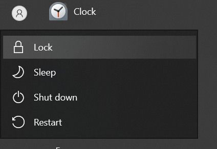
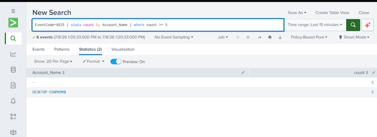
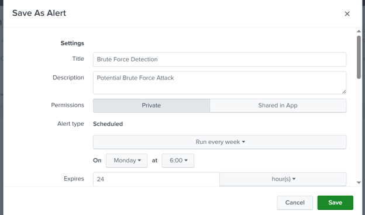

# Brute Force Detection

## Objective

Detect repeated failed Windows authentication attempts.

---

## Overview 

Multiple failed login attempts may indicate password spraying or brute force attacks.

---

## MITRE ATT8CK

   | Technique | Description |
   |---|---|
   | T1110 | Brute Force |

---

## Data Sources

Windows Security Log
Event ID 4625

---

## Attack Simulation

Entered an incorrect password multiple times to trigger account lockout.

---

## Results

The repeated failed logins were detected and visualized in the dashboard.

We can also set an alert if similar events occur.

## Analyst Notes

Correlate with successful logins (4624) to determine whether the attacker eventually authenticated.
